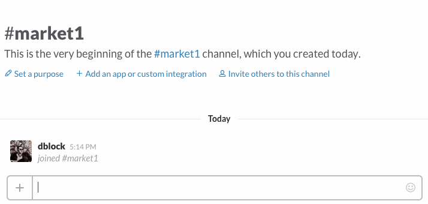

Slack Market
============

A stock market bot for Slack.

## Install

Invite *@market* to a channel with `/invite @market`.

## Usage

### Quotes from Yahoo Finance

Mention a stock ticker and get a quote. Single-character stocks should include a $ sign, eg. `$F`.

### Settings

#### set dollars on|off

Set to `on` to respond to `$MSFT`, but not `MSFT`.

### Copyright & License

Copyright [Daniel Doubrovkine](http://code.dblock.org), 2016

[MIT License](LICENSE)
